<h1 align="center">Welcome to my GitHub! I'm Jonathan – IT Engineer & Software Developer</h1>

 
  

###

###

  

###

- Work, organization, teamwork and good study habits. - I currently work on projects that solve personal challenges, focusing on creativity and problem-solving.

###

<h2 align="center">About me</h2>

###

Greetings from Salinas, Ecuador! I'm passionate about creating innovative solutions that combine functionality with engaging design. With strong development and design skills, I specialize in delivering exceptional user experiences through web and mobile applications.  I have been developing software since 2022, gaining experience in Full-Stack Development, UX/UI, and 3D Design. I am currently learning programming with a focus on Data Science, and I plan to work remotely or in-office in the future.

###

<h3 align="center">Frontend</h3>

###

  
  
  
  
  
  
  
  
  
  
  
  
  
  
  

###

<h3 align="center">Backend</h3>

###

  
  
  
  
  
  
  
  
  
  
  
  
  
  
  
  
  
  
  
  
  
  
  
  
  

###
